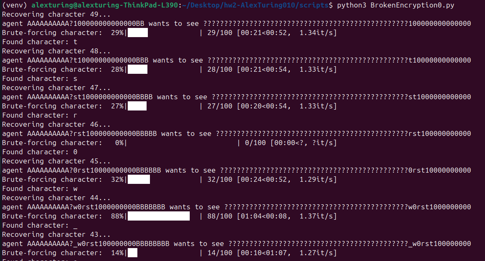

This was a really fun challenge. The server was using ECB mode to encrypt a message of the form:

```python
f"agent {agent} wants to see {flag}"
```

The `agent` part is controlled by us (input), while the `flag` is unknown and what we need to recover.

Now, the thing with ECB is that it encrypts **blocks of 16 bytes independently**, using the same key. This means **identical plaintext blocks always produce the same ciphertext blocks** — a huge weakness and exactly what we’re going to exploit.

## Padding Function

The server pads the message before encryption using this function:

```python
def pad(message: str) -> bytes:
    padded = message + '1'
    while len(padded) % 16 != 0:
        padded += '0'
    return padded.encode()
```

A couple of important things to notice here:

- It **always adds a `'1'` first**, even if the input is already a multiple of 16.
- That can result in **a whole extra block** being added due to the padding.

This behavior was important for my attack plan since I had to be super precise with how offsets align with AES blocks.

---

## Step 1: Determining the Flag Length

To begin, I needed to figure out how many bytes long the flag was. To do this, I:

1. Supplied different lengths of input for `agent`.
2. Observed how the ciphertext length changed (remember, it grows in 16-byte increments).
3. Using the padding logic, I calculated how much of the message was padding.

With that info, and knowing how the padded message was constructed, I could back-calculate the length of the flag. It turned out to be **49 bytes long**.

---

## Step 2: Recovering the Flag (Byte by Byte)

Once I had the length, I crafted a strategy that exploited the predictability of ECB mode.

Here's the key idea:

- If I can force the **last block** to be mostly padding, except for **one known character** of the flag, and then **replicate that block earlier** using my controlled input, I can brute-force characters until the two blocks match.
- When they do, I know I guessed that character correctly.

Using this method, I can recover **one character at a time**, starting from the end of the flag and working backwards.

---

## Step 3: The Attack Script

This process would take forever manually, so I automated it. Here's the attack script I wrote to brute-force the flag, one character at a time:

```python
# My masterpiece attack script that brute forces the flag characters one character at a time!

import socket
import string
from tqdm import tqdm

# Configuration
HOST = "shell.hackintro25.di.uoa.gr"
PORT = 65095
BLOCK_SIZE = 16
FLAG_LENGTH = 49
CHARSET = string.printable

def connect_to_service(agent_input):
    with socket.socket(socket.AF_INET, socket.SOCK_STREAM) as s:
        s.connect((HOST, PORT))
        s.recv(4096).decode()
        s.sendall(f"{agent_input}\n".encode())
        ciphertext = s.recv(4096).decode().strip()
        return ciphertext

def pad(message: str) -> bytes:
    padded = message + '1'
    while len(padded) % 16 != 0:
        padded += '0'
    return padded

def brute_force_flag():
    recovered_flag = ""

    for i in range(FLAG_LENGTH):
        print(f"Recovering character {FLAG_LENGTH - i}...")

        agent_padding = "A" * 10
        agent_offset = "B" * (i + 2)
        flag = "?" * (FLAG_LENGTH - i) + recovered_flag

        input = "?" + recovered_flag
        if len(input) >= 16:
            input = input[:16]
            input = agent_padding + input + agent_offset
        else:
            input = agent_padding + pad(input) + agent_offset

        plain_text = f"agent {input} wants to see {flag}"
        print(f"{pad(plain_text)}")

        found = False
        char = ""
        for char in tqdm(CHARSET, desc="Brute-forcing character", ncols=80):
            input = char + recovered_flag
            if len(input) >= 16:
                input = input[:16]
                input = agent_padding + input + agent_offset
            else:
                input = agent_padding + pad(input) + agent_offset

            ciphertext = connect_to_service(input)
            seventh_block = ciphertext[(7 - 1) * BLOCK_SIZE * 2 : 7 * BLOCK_SIZE * 2]
            second_block = ciphertext[BLOCK_SIZE * 2:BLOCK_SIZE * 4]

            if seventh_block == second_block:
                recovered_flag = char + recovered_flag
                found = True
                break

        if not found:
            print(f"Failed to recover character {FLAG_LENGTH - i}.")
            break
        else:
            print(f"Found character: {char}")

    return recovered_flag

if __name__ == "__main__":
    flag = brute_force_flag()
    print(f"Recovered flag: {flag}")
```

---

## Screenshot of the First Iterations



---

## Final Flag

After letting the script run for a while, I successfully recovered the full flag:

```
d72ab5a083c2dffdec5a1107bca11e26_ECB_is_the_w0rst
```
