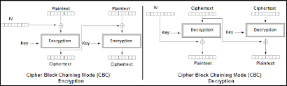

This challenge was frustrating at first. I couldn't understand what was going wrong: the ciphertexts I encrypted wouldn't decrypt properly. I was using CBC mode, and every time I encrypted the same plaintext, I got a different ciphertext. Not just that — when I ran the script locally, I got an error. It turns out my version of `Cryptodome` doesn't allow the same AES object to both encrypt and decrypt consecutively.

---

## Discovery and Hypothesis

I noticed something strange: by coincidence, I had the idea (being inexperienced with cryptography) that maybe the tool expected me to **prefix the IV to the ciphertext**, so it would know which IV to use for decryption. When I tried that, I got a decryption that started with 16 blocks of garbage — **but surprisingly, the plaintext was correctly recovered afterward**!

That garbage puzzled me. But then the realization hit me.

---

## Understanding CBC Internals

Here's what I figured out:

- In CBC mode, the decryption process XORs each decrypted block with the previous ciphertext block (or IV for the first block).
- `Cryptodome` seems to **keep an internal “last block”** to do this chaining. Initially, this is the IV, and then it updates to the last encrypted block.
- After an encryption, this internal "last block" becomes the last block of the ciphertext.
- So, when I prefixed the IV to the ciphertext and attempted decryption, the AES object tried to decrypt the IV as if it were a ciphertext block, and XORed it with last 16 bytes of the ciphertext, resulting in garbage.

That garbage was the decrypted IV XORed with the last ciphertext block. **The next block, however, decrypted correctly**, since it was XORed with the actual IV — leading to a valid plaintext recovery.

---

## Decryption Strategy

Once I understood how the CBC state machine worked internally, I developed a strategy to decrypt the flag **block by block**.

I assumed the flag was three blocks long. The last block turned out to be just padding, but I decrypted it anyway to confirm.

Below is a visual to keep in mind as I explain how CBC encryption and decryption works:



---

### Step-by-step: Decrypting the First Block

1. **Get the IV**  
   I created an AES encryptor and got the IV.

2. **Encrypt some plain text with normal padding**
   I encrypted some random data (e.g., `"AA"`) which would be padded by the program.

3. **Encrypt the Flag**  
   I encrypted the flag. In this step, the IV used was the ciphertext from encrypting `"AA"`.

4. **Craft a Decryption Payload**  
   Here’s the key trick:

   - Take the **first 16 bytes of the flag ciphertext**.
   - Append the **IV**.
   - Append the **ciphertext of `"AA"`**.

   Why this strange structure?

   If I just put the flag's ciphertext and tried to decrypt, the last byte (used for padding validation) would often take a large value, leading to an invalid unpadding and an empty result. By appending a valid padded block like `"AA"` at the end, I ensured the padding check would pass.

   > Note: I also couldn't put the actual flag text in the payload, because the server filters it and won’t print it if the result contains the flag.

5. **Analyze the Decryption Output**  
   The decryption returned a blob of plaintext, the first 16 bytes of which were interesting. These 16 bytes were:

```

DecryptedBlock = FlagBlock\_1 XOR CiphertextBlock\_3 XOR Ciphertext\_AA

```

So, to recover the actual first block of the flag:

```

FlagBlock\_1 = DecryptedBlock XOR CiphertextBlock\_3 XOR Ciphertext\_AA

```

---

### Decrypting the Remaining Blocks

The logic for the next blocks is the same, with a small twist in chaining:

- To decrypt **Block 2**, craft a payload using:
- `CiphertextBlock_2`
- `IV`
- `Ciphertext_AA`

Then:

```

FlagBlock\_2 = DecryptedBlock XOR CiphertextBlock\_3 XOR CiphertextBlock\_1

```

- For **Block 3**, do the same with:
- `CiphertextBlock_3`
- `IV`
- `Ciphertext_AA`

Then:

```

FlagBlock\_3 = DecryptedBlock XOR CiphertextBlock\_3 XOR CiphertextBlock\_3

```

I did this, and found that Block 3 was just padding — all zeros. The first 2 blocks are enough to form the flag!
