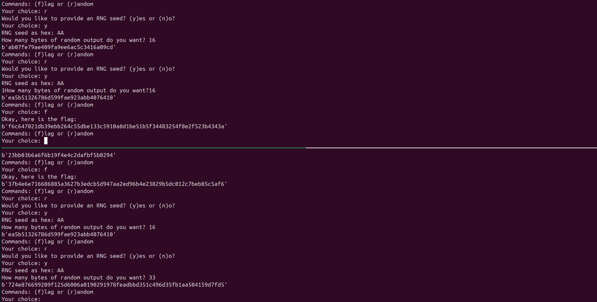

This challenge was nonsense.

At first, I thought I was onto something with a known-plaintext attack. We can recover the keystream used to encrypt our plaintext. But then I realized that’s basically useless, because as soon as we ask for the flag, a **different keystream** is used. Classic CTR mode behavior: the keystream is generated fresh each time based on a nonce. So unless we plan on **breaking AES** and magically recovering the key or nonce... yeah, not happening. We're not quite wizard-level hackers yet.

But then I noticed something interesting. The nonce isn’t some random UUID, it’s constructed from the current time, the machine’s MAC address, and the process ID (PID). The MAC address stays constant, and the PID affects only the low bits, which are easy to change as the counter increments. The time, though, is a big one: it's in the higher bits of the nonce, so even if the counter increments, it won’t touch those anytime soon.

That got me thinking: what if I opened two connections at almost exactly the same time? If the time part of the nonce is identical and only the PIDs differ, maybe I could get the same keystream. But this only works if the nonces are close enough that I can align them by incrementing the counter.

So I tried:

```bash
tmux new-session \; \
  split-window -h "nc shell.hackintro25.di.uoa.gr 14958" \; \
  select-pane -t 0 \; \
  send-keys "nc shell.hackintro25.di.uoa.gr 14958" C-m
```

and also:

```bash
gnome-terminal --tab -- bash -c "nc shell.hackintro25.di.uoa.gr 14958; exec bash" \
--tab -- bash -c "nc shell.hackintro25.di.uoa.gr 14958; exec bash"
```

But both of those failed. The delay between sessions was just too big, especially with `gnome-terminal`, which has a noticeable startup time. Even with `tmux`, the way I did it above had just enough lag to throw off the nonce timing.

Eventually, I found a better way:

```bash
#!/bin/bash

REMOTE_HOST="shell.hackintro25.di.uoa.gr"
REMOTE_PORT=14958

tmux new-session -d -s dual_conn "nc $REMOTE_HOST $REMOTE_PORT"
tmux split-window -h "nc $REMOTE_HOST $REMOTE_PORT"
tmux select-layout tiled
tmux attach-session -t dual_conn
```

This one worked way better. It started both Netcat sessions nearly simultaneously. The nonces weren’t exactly the same, the PIDs were different, which shifted the lower bits, but the upper (time-based) bits were the same. That meant I could just send a few inputs in the session with the lower PID to bump its counter up and align the keystreams.

Once that was done, the attack was easy:

- In one session, send a known plaintext to recover the keystream.
- In the second, encrypt the flag using that exact same keystream.
- XOR everything back together to recover the original flag.

Here’s a screenshot of the two sessions in action:



And here's the script I used to recover the flag, based on the output from the server and the `nonsense.py` script provided:

```python
from binascii import unhexlify
from Cryptodome.Hash import SHA256

def raw(x):
    return bytes(map(lambda y: y if isinstance(y, int) else ord(y), x))

# Server outputs
encrypted_flag_hex = "f6c647021db39ebb264c55dbe133c5910a8d1be51b5f34483254f8e2f523b4343a"
encrypted_seed_hex = "724e876699209f125d6006a0190291978feadbbd351c496d35fb1aa504159d7fd5"

# Seed as a hex string
seed_hex = "AA"

# Convert hex outputs to bytes
encrypted_flag = unhexlify(encrypted_flag_hex)
encrypted_seed = unhexlify(encrypted_seed_hex)
seed = unhexlify(seed_hex)

# Compute hashed seed
hashed_seed = SHA256.new(raw(seed)).digest()
hased_seed2 = SHA256.new(raw(hashed_seed)).digest() # Because we asked for output of 33 bytes if you check nonsense.py
hashed_seed += hased_seed2[0:1]                     # This is how its done, turns out the last character of the flag is just a newline though

# Recover the flag
flag = bytes([ef ^ es ^ hs for ef, es, hs in zip(encrypted_flag, encrypted_seed, hashed_seed)])
print("Recovered flag (hex):", flag.hex())

# Attempt to decode the flag to characters
try:
    decoded_flag = flag.decode("utf-8")
    print("Recovered flag (decoded):", decoded_flag)
except UnicodeDecodeError:
    print("Recovered flag could not be decoded to UTF-8 characters.")
```

### Final Flag:

```
8f611358d0dc6417190cb8b0e1d5e736
```

Turns out the last byte was just a newline. If I had guessed that earlier, I could’ve made the script even simpler. Oh well.
